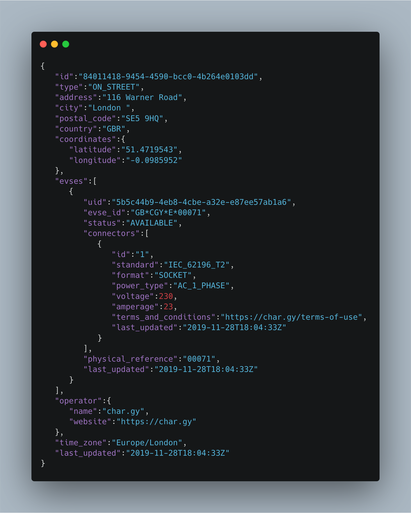

The goal of this project is to provide a way to discover the location of every electric vehicle charge point across all networks and operators.

**It is essentially a collection of links to lists of charge points in a common format.**

More specifically, it's a collection of federated open [OCPI Location module](https://github.com/ocpi/ocpi/blob/master/mod_locations.asciidoc) API implementations.

[Download](https://ocpi-register.github.io/ocpi-register/register.json)

## Why

So far the industry has been unable to provide a sustainable and reliable central repository of charge points. The source of funding, the scope of the service, conflicting corporate interests, and data formats have slowed progress.

*A federated model* - A [federated architecture](https://en.wikipedia.org/wiki/Federated_architecture) means that the operators run
their own APIs. This means a single source of funding isn't required to keep it running, and it also means there isn't a single point of failure.

*Open locations as a minimum* - The minimum requirement to use a charge point is to know where and what it is. Not even dynamic status/occupancy data is an absolute requirement. Other modules provided by an operator may require authorisation, but the locations must be available without authorisation.

*OCPI* - The module approach allows an operator to implement the minimum requirement - static location data - without building out the dynamic data or roaming aspects, which keeps costs low for small operators and allows businesses to avoid features incompatible with their strategy.

## What a single OCPI location looks like

## How to contribute

Create an [issue](https://github.com/char-gy/ocpi-register/issues) or a [pull request](https://github.com/char-gy/ocpi-register/pulls).

## License

This project is under the [MIT license](https://github.com/ocpi-register/ocpi-register/blob/master/LICENSE).
